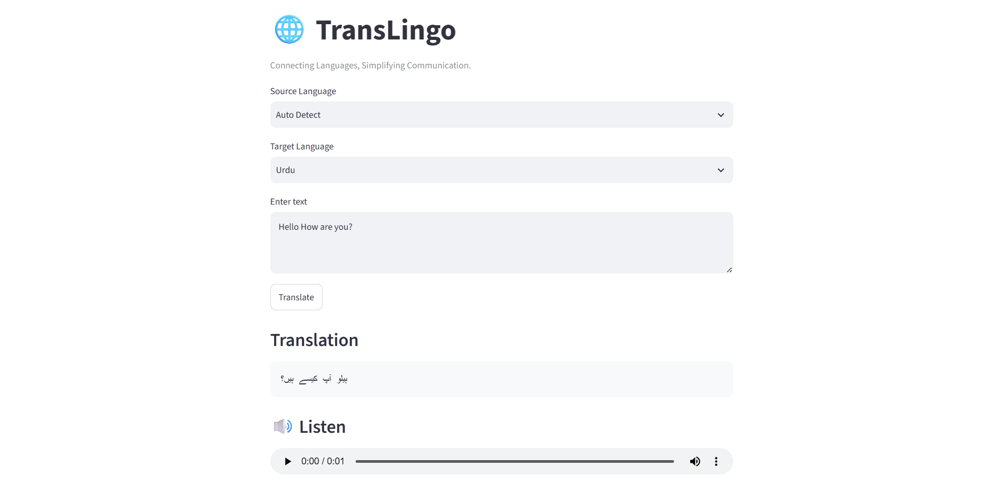

<div align="center">

# 🌐 TransLingo

### AI-Powered Language Translation Web Application


🚀 **Live Demo**

<a href="https://codealphaaitask1translingo-jksmtyffff58rfxrqsojl6.streamlit.app/">

</a>

</div>

---

## 📖 Overview

**TransLingo** is a web-based language translation application built using **Python and Streamlit**.

The application allows users to translate text between multiple languages with automatic source-language detection. It also provides additional features such as copying translated text and converting translations into speech through an interactive interface.

---

## ✨ Features

- 🌍 Translation between **15+ languages**
- 🔍 Automatic language detection
- 🔄 Source and target language selection
- 📋 Copy translated text
- 🔊 Text-to-speech support
- ⚡ Input validation and error handling
- 🖥️ Interactive Streamlit interface

---

## 🛠️ Tech Stack

- Python
- Streamlit
- Deep Translator
- Google Translator API
- gTTS (Google Text-to-Speech)

---

## 📂 Project Structure

```text
TransLingo/
├── app.py
├── requirements.txt
└── README.md
```

---

## ⚙️ Getting Started

Clone the repository:

```bash
git clone https://github.com/anmolgoreja/TransLingo.git
```

Navigate to the project folder:

```bash
cd TransLingo
```

Install dependencies:

```bash
pip install -r requirements.txt
```

Run the application:

```bash
python -m streamlit run app.py
```

---

## 🖥️ Demo

<p align="center">
  
</p>

---

## 🎓 Internship Project

Developed as part of the **CodeAlpha AI Internship**.

---

<div align="center">

## 👩‍💻 Author

**Anmol Goreja**

<a href="https://github.com/anmolgoreja">

</a>
<a href="https://pk.linkedin.com/in/anmol-goreja">

</a>

</div>